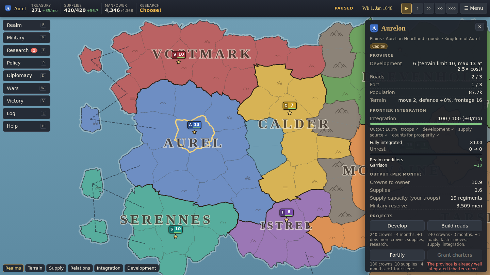

# Crown & Frontier

A single-player grand strategy game for the browser. You rule a young crown in the Reach,
a divided continent, in 1640. Grow by settlement, investment or conquest — but every
province you gain beyond your heartland is **raw frontier** that pays little, raises no
troops and supplies no armies until you integrate it. Outlast eight AI rivals and win by
territorial dominance, economic prosperity or diplomatic leadership.



- No installation, account or server: static HTML5 files, and everything runs in your browser.
- 99 provinces, 9 realms, 12 unclaimed frontier provinces, and the Greyspine mountains with three passes.
- Economy, population and manpower, supply lines, context-sensitive battles, sieges,
  research, national policies, diplomacy and coalitions, 17 events, and three victory paths.
- AI rivals with five temperaments and three difficulty levels. They use exactly the same
  rules and commands as you.
- Tutorial, tooltips and visible reasons for every unavailable action, autosave, and save
  export/import. Works with mouse, keyboard and touch.

## Play

Open the hosted build in any current browser. Once GitHub Pages is enabled for this
repository (see [DEPLOYMENT.md](DEPLOYMENT.md)) it is served at
`https://<owner>.github.io/crown-and-frontier/`; no live URL has been published yet.
Any static web host works: upload the contents of the release ZIP.

The game must be served over `http(s)://`. Opening `index.html` directly from disk
(`file://`) does not work, because browsers block module scripts there; the page explains
this if you try.

### Controls

| Action | Mouse / keyboard | Touch |
|---|---|---|
| Select a province or army | Click | Tap |
| Move the selected army | Right-click a province, or **G** / "Set destination" then click | Long-press a province, or "Set destination" then tap |
| Pan / zoom | Drag / mouse wheel, arrow keys, **+ / −** | Drag / pinch |
| Pause, speed | **Space**, **1–4** | ▶ and speed buttons |
| Ledgers | **B** realm, **M** military, **T** research, **P** policy, **D** diplomacy, **W** wars, **V** victory, **L** log, **H** help | Bottom bar |
| Map overlays | **O** cycles (realms, terrain, supply, relations, integration, development) | Overlay buttons |
| Other | **N** next army, **Home** capital, **Esc** close / deselect | ✕ buttons |

### Saves

- **Autosave** runs every few in-game months (see Settings) and whenever the tab is hidden or closed.
  It alternates between two slots, so an interrupted write never destroys the only copy.
- **Manual saves** go to three slots via ☰ Menu.
- **Export and import** write and read a `.json` file, so a campaign can move between browsers, devices or sites.
- **Where saves live:** in this browser only (IndexedDB, falling back to localStorage or, if storage is
  blocked, memory for the session). They do **not** sync between devices or websites, and private
  browsing or managed-device (school) policies may erase them. Export anything you care about.
- **Damaged files:** truncated, modified or foreign save files are rejected with an explanation, and
  your current campaign is kept.

## Develop

Requires Node.js 22 and npm.

```bash
npm ci                 # install exact dependency versions from package-lock.json
npm run dev            # dev server at http://localhost:5173
npm test               # rule, persistence, determinism and AI tests (Vitest)
npm run build          # type-check + production build into dist/
npm run package        # release/crown-and-frontier-web.zip (index.html at the root) + .sha256
npm run verify:web     # browser checks (root, subpath, ZIP, iframe, touch, saves, storage, performance)
npm run sim -- --seeds 1-10 --difficulty all --years 40 --out reports/ai-campaigns.md   # AI-only campaigns
npm run examples       # worked combat examples from the real combat code
npm run genmap         # regenerate map geometry after moving province seeds in src/data/reach.ts
npm run check          # typecheck + tests + build + package + verify:web
```

`verify:web` needs Chromium for Playwright. Run `npx playwright install chromium` once, unless your
environment already provides it.

### Project layout

```
src/sim/        headless simulation — no DOM; runs in tests and CLI tools
  types.ts      state and command types        config.ts   every tunable number
  commands.ts   the single validation boundary for player AND AI actions
  tick.ts       fixed weekly tick order        game.ts     new-game setup
  economy, construction, integration, military, movement, supply, combat, siege,
  war, diplomacy, progression, events, victory, invariants, save
  ai/           strategic, operational/execution layers and difficulty profiles
  data/         technologies, policies, personalities, events
src/data/       the Reach scenario (reach.ts) and generated map geometry (reach.map.json)
src/ui/         Canvas map renderer, panels, ledgers, dialogs, tutorial, storage, audio
tools/          map generator, AI campaign runner, ZIP packager, web verifier, combat examples
tests/          Vitest suites
e2e/            scripted browser playthrough (development helper)
reports/        generated evidence: AI campaign statistics, web verification
```

**Reporting bugs:** Chronicle ledger (**L**) → *Export bug report*. The file contains the seed, settings,
your command log, recent notifications and AI diagnostics. Given the same seed and commands, the
simulation replays deterministically.

## Documentation

- [DESIGN.md](DESIGN.md): the implemented rules, formulas, worked examples, AI and balance evidence.
- [DEPLOYMENT.md](DEPLOYMENT.md): GitHub Pages, other hosts, the ZIP, embedding, and browser compatibility.
- [STATUS.md](STATUS.md): the requirement ledger, acceptance checks, known limitations and next steps.
- [THIRD_PARTY_NOTICES.md](THIRD_PARTY_NOTICES.md): licences of development tools. No third-party code
  or assets ship in the game.

## Known limitations

- **Balance:** tuned against AI-only campaigns only. Aurel and Tarsk win most of them, and small
  defensive realms tend to shrink. No external players have tested it yet.
- **Fog of war:** not implemented. All information is public to everyone, AI included.
- **Browsers verified:** only headless Chromium 141, on desktop and emulated phone viewports. Firefox,
  Safari, real Chromebooks and real touch devices are untested.
- **Out of scope:** naval warfare, multiplayer, espionage, dynasties and production chains.
- **Save format:** schema 1. Future format changes will need migrations, and none exist yet.

## Licence

This repository does not yet include a source licence. The owner decides the licence and whether the
repository is public. All game content (names, map, rules and text) is original. See
THIRD_PARTY_NOTICES.md for the development tools.
