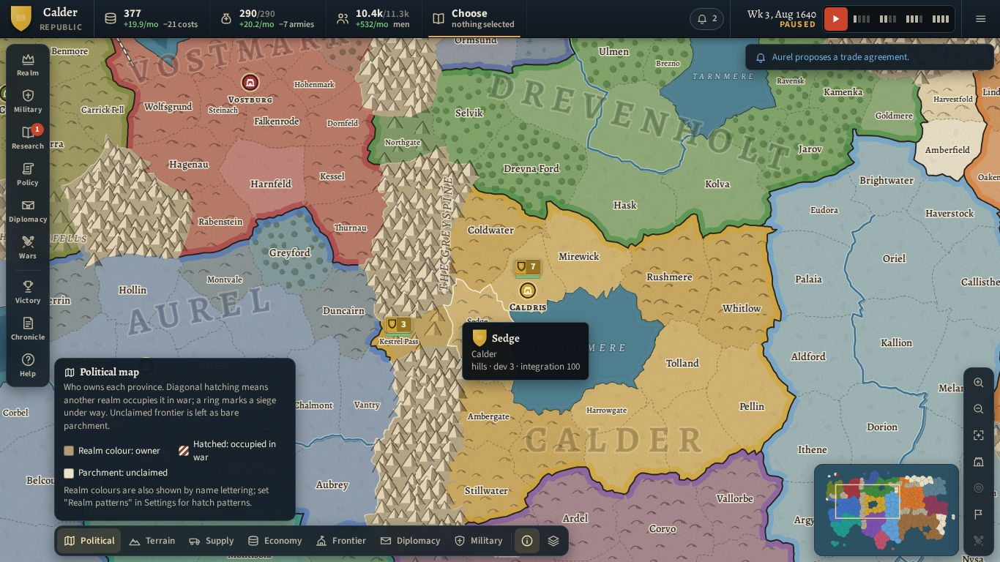

# Crown & Frontier

A single-player grand strategy game for the browser. You rule a young crown on a divided
continent in 1640. Grow by settlement, investment or conquest, but every province you gain
beyond your heartland is **raw frontier**: it pays little, raises no troops and supplies no
armies until you integrate it. Outlast your AI rivals and win by territorial dominance,
economic prosperity or diplomatic leadership.



- **Two maps.** *Aldmere*, the standard campaign, has 298 provinces, 14 realms, four mountain
  ranges with six passes, six rivers and 34 unclaimed frontier provinces. *The Reach*, the
  quick campaign, has 99 provinces and 9 realms.
- **A living political atlas.** The map shows printed relief, rivers and lettered seas, with
  realm washes and inked borders. Detail changes with zoom, and seven map modes (political,
  terrain, supply, economy, frontier, diplomacy, military) each come with a legend.
- **Systems:** economy, population and manpower, supply lines, battles shaped by terrain,
  rivers and forts, sieges, research, national policies, diplomacy and coalitions, 17 events,
  and three victory paths.
- **AI rivals:** five temperaments and three difficulty levels, using exactly the same rules
  and commands as you.
- **Help and saving:** a tutorial, rich tooltips, visible reasons for every unavailable
  action, battle forecasts, army groups and standing orders, autosave, and save
  export/import. Works with mouse, keyboard and touch.
- **No installation, account or server:** static HTML5 files; everything runs in your browser.

## Play

Open the hosted build in any current browser. Once GitHub Pages is enabled for this
repository (see [DEPLOYMENT.md](DEPLOYMENT.md)) it is served at
`https://<owner>.github.io/crown-and-frontier/`; no live URL has been published yet.
Any static web host works: upload the contents of the release ZIP.

The game must be served over `http(s)://`. Opening `index.html` directly from disk
(`file://`) does not work, because browsers block module scripts there; the page explains
this if you try.

### Controls

| Action | Mouse / keyboard | Touch |
|---|---|---|
| Select a province or army | Click | Tap |
| Move the selected army | Right-click a province, or **G** / Move then click | Long-press a province, or "March here" in the province card |
| Add a waypoint | **Shift**+right-click | — |
| Pan / zoom | Drag / mouse wheel, arrow keys, **+ / −** | Drag / pinch |
| Pause, speed | **Space**, **1–4** | ▶ and speed pips |
| Ledgers | **B** realm, **M** military, **T** research, **P** policy, **D** diplomacy, **W** wars, **V** victory, **L** chronicle, **H** help | Bottom bar |
| Map modes | **Shift+1…7**, **O** cycles | Mode bar |
| Navigate | **F** whole map, **C** centre selection, **Home** capital, **N** next army, **Shift+N** next army group, **K** next battle, **J** latest alert | Navigation buttons |
| Close | **Esc** cancels, closes, then opens the menu | ✕ buttons |

### Saves

- **Autosave** runs every few in-game months (see Settings) and whenever the tab is hidden or closed.
  It alternates between two slots, so an interrupted write never destroys the only copy.
- **Manual saves** go to three slots via ☰ Menu.
- **Export and import** write and read a `.json` file, so a campaign can move between browsers, devices or sites.
- **Where saves live:** in this browser only (IndexedDB, falling back to localStorage or, if storage is
  blocked, memory for the session). They do **not** sync between devices or websites, and private
  browsing or managed-device (school) policies may erase them. Export anything you care about.
- **Damaged files:** truncated, modified or foreign save files are rejected with an explanation, and
  your current campaign is kept.
- **Each save keeps its map.** Campaigns started on the Reach, including saves from the previous
  release, load on the Reach. The save format is unchanged (schema 1), so no conversion is needed.

## Develop

Requires Node.js 22 and npm.

```bash
npm ci                 # install exact dependency versions from package-lock.json
npm run dev            # dev server at http://localhost:5173
npm test               # rule, persistence, determinism and AI tests (Vitest)
npm run build          # type-check + production build into dist/
npm run package        # release/crown-and-frontier-web.zip (index.html at the root) + .sha256
npm run verify:web     # browser checks (root, subpath, ZIP, iframe, touch, saves, storage, performance)
npm run sim -- --scenario aldmere --seeds 1-10 --difficulty all --years 60 --out reports/ai-campaigns-aldmere.md
npm run sim -- --scenario reach --seeds 1-10 --difficulty all --years 40 --out reports/ai-campaigns.md
npm run examples       # worked combat examples from the real combat code
npm run genworld       # regenerate Aldmere from tools/aldmere.spec.ts (deterministic)
npm run genmap         # regenerate the Reach's geometry (byte-identical to the checked-in file)
npm run check          # typecheck + tests + build + package + verify:web
```

`verify:web` needs Chromium for Playwright. Run `npx playwright install chromium` once, unless your
environment already provides it.

### Project layout

```
src/sim/        headless simulation — no DOM; runs in tests and CLI tools
  types.ts      state and command types        config.ts   every tunable number
  commands.ts   the single validation boundary for player AND AI actions
  tick.ts       fixed weekly tick order        game.ts     new-game setup
  economy, construction, integration, military, movement, supply, combat, siege,
  war, diplomacy, progression, events, victory, invariants, save
  ai/           strategic, operational/execution layers and difficulty profiles
  data/         technologies, policies, personalities, events
src/data/       both maps: realms and regions (aldmere.ts, reach.ts), generated province data
                (aldmere.provinces.json, reach.adjacency.json) and geometry (*.map.json, loaded on demand)
src/ui/         map renderer (map/), design system (style.css), HUD, inspector, ledgers,
                dialogs, screens, tutorial, storage, audio
tools/          map generators (mapgen/core.ts shared), AI campaign runner, realm tracer,
                ZIP packager, web verifier, combat examples
tests/          Vitest suites
e2e/            scripted browser playthrough (development helper)
reports/        generated evidence: AI campaign statistics, web verification
```

**Reporting bugs:** Chronicle ledger (**L**) → *Export bug report*. The file contains the seed, settings,
your command log, recent notifications and AI diagnostics. Given the same seed and commands, the
simulation replays deterministically.

## Documentation

- [DESIGN.md](DESIGN.md): the implemented rules, formulas, worked examples, AI and balance evidence.
- [DEPLOYMENT.md](DEPLOYMENT.md): GitHub Pages, other hosts, the ZIP, embedding, and browser compatibility.
- [STATUS.md](STATUS.md): the requirement ledger, acceptance checks, known limitations and next steps.
- [docs/REDESIGN.md](docs/REDESIGN.md): the interface and world redesign: diagnosis, direction and what was built.
- [THIRD_PARTY_NOTICES.md](THIRD_PARTY_NOTICES.md): the three bundled OFL fonts (licences ship in
  `licenses/`) and the development tools. No other third-party code or assets ship in the game.

## Known limitations

- **Balance:** tuned against AI-only campaigns on both maps (see STATUS.md). The richest
  heartland wins most often: Lessia on Aldmere (13 of 30) and Aurel on the Reach (15 of 30).
  Some small or exposed realms shrink on average. No external players have tested either
  map yet.
- **Fog of war:** not implemented. All information is public to everyone, AI included.
- **Browsers verified:** only headless Chromium 141, on desktop and emulated phone viewports. Firefox,
  Safari, real Chromebooks and real touch devices are untested.
- **Out of scope:** naval warfare, multiplayer, espionage, dynasties and production chains.
- **Save format:** schema 1. This version only added optional fields; a future format change
  will need a migration.

## Licence

This repository does not yet include a source licence. The owner decides the licence and whether the
repository is public. All game content (names, map, rules and text) is original. See
THIRD_PARTY_NOTICES.md for the development tools.
